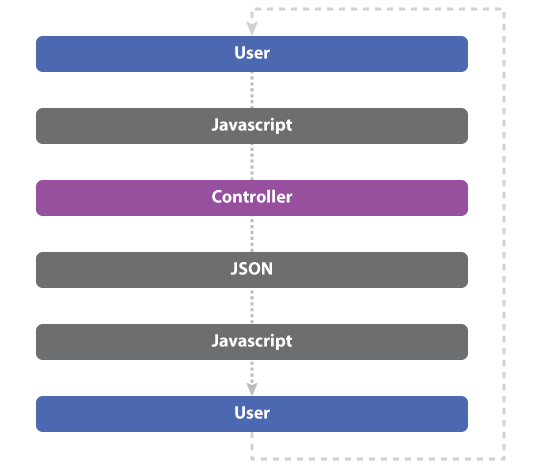
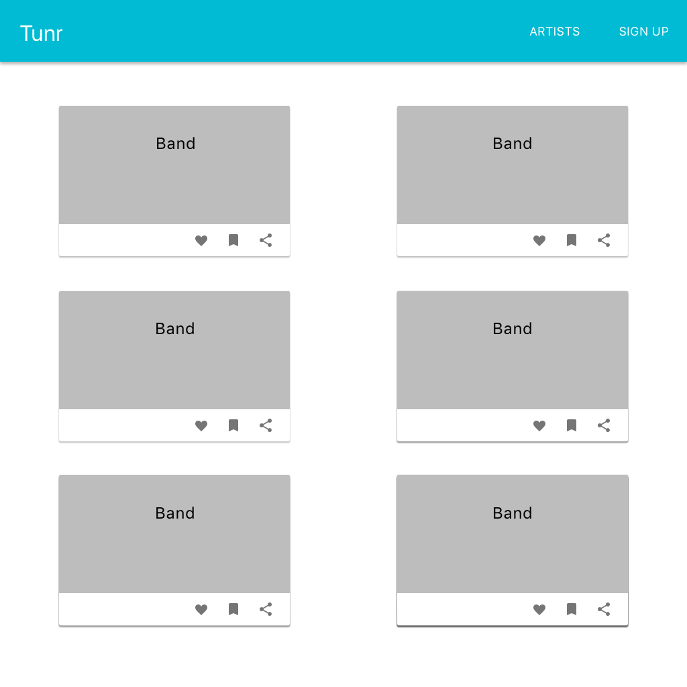
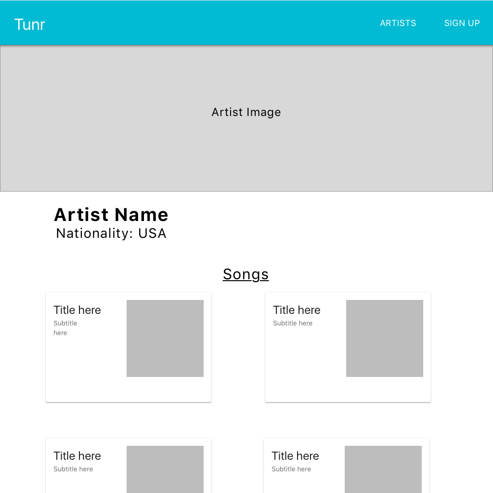
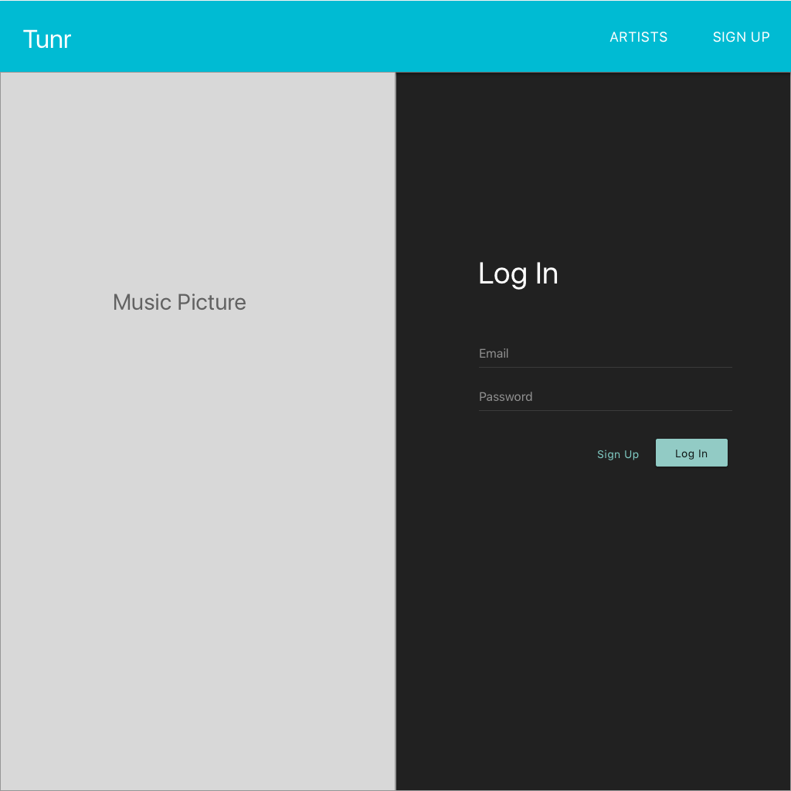
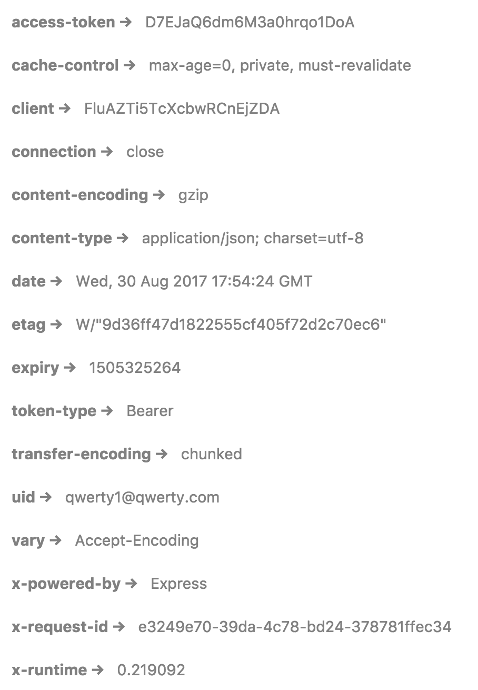

# React On Rails (w/ Auth)

## Learning objectives

- Give an example of when and why one might choose to put an React app on Rails.
- Utilize node scripts to build and move a React UI.
- Generate an API-only Rails application.
- Generate and retrieve auth tokens using Devise and LocalStorage.

## Framing

### Rails vs React

So far we've seen React apps with a custom built back-end using Express, and Rails apps with no front-end framework. Now we're going to combine the two and make a Rails app that uses React on the front-end.

Today we are going to be building an application takes advantage of the ease-of-use of Rails with the front-end power that we get from using React.

### Why?

In a typical Rails app the user interacts with data through some combination of links, forms, and JavaScript.


In a React-on-Rails app the user interacts with data just through JavaScript.



This means they have a "single point of contact" with your data. This has two advantages: the user experience may have more consistency (AJAX vs page refreshes), and you have fewer moving parts to worry about.

The trade off here is the need to write more JavaScript.

### Getting Started
Lets start out by setting up our environment.

1. Create a Rails API application
```bash
  rails new tunr_react_rails --api -d postgresql
  cd tunr_react_rails
```
**IMPORTANT** Notice the `--api` flag.  This sets up a stripped down version of Ruby on Rails which removes views from the framework.  We will be handling the views in our React app.

This sets up our Ruby on Rails API and generates our file structure.  At this point we should be able to run a `rails s` and see the Rails Hello World screen, but there are a few more steps to include React in the application.

2. Create a React app through `create-react-app`
```bash
  create-react-app client
``` 
3. Create a `package.json` file at the root level and add this JSON
```json
{
  "name": "YOUR PROJECT NAME",
  "engines": {
    "node": "8.2.1"
  },
  "scripts": {
    "build": "cd client && npm install && npm run build && cd ..",
    "deploy": "cp -a client/build/. public/",
    "postinstall": "npm run build && npm run deploy && echo 'Client built!'"
  }
}
```
> WARNING!!! Be sure to replace "YOUR PROJECT NAME" above with your real project name.

> This package.json will be used to build the create-react-app and serve the static build file in production.  This is similar to the postinstall script we used when dealing with express in the past.

> Some magic is happening here.  Since we tell Heroku to install the build in the public folder, Heroku will open the index.html page that is in public when we hit the index route for our app

4. Set up a proxy for our dev server within the `client` level `package.json
```json
{
  "name": "client",
  "version": "0.1.0",
  "private": true,
  "proxy": "http://localhost:3001",
  ...
}
```
> This sets up the ability to call our Rails API without directly referencing localhost:3001

5. Create a script that allows our API server and dev server to run at the same time. In the past we used `concurrently`, however Ruby has a similar tool called `foreman`.
```bash
  gem install foreman
``` 

6. After installing `foreman`, create a file titled `Procfile.dev` and paste the following code.
```
web: cd client && PORT=3000 npm start
api: rails s -p 3001
```

7. You are now able to use `foreman` and the `Procfile.dev` to set up your development environment.  
```bash
  foreman start -f Procfile.dev
```

With that, we can now start building React-On-Rails!

**COMMIT**

## Back-End: Ruby on Rails

### Model Set-Up and Seed
Now that we have our project properly set up, lets work on creating and seeding our data and serving it as an API for our React UI to consume.

```bash
  rails g model Artist name photo_url nationality
  rails g model Song title album preview_url artist:references
```

Let's seed our database with our old Tunr data. Copy the code for our seeds from this gist. [Tunr Seed Data](https://gist.github.com/king0120/a465fe25558c63bcb6d2a8091da1cea4)

Now let's create, migrate, and seed our database.  Then we can test and make sure that ActiveRecord can fetch the data we need

```bash
    rails db:create db:migrate db:seed
```

Finally, we'll add a has_many relationship to Artist
```ruby
# app/model/artist.rb
class Artist < ApplicationRecord
  has_many :songs, dependent: :destroy
end
```

Lets hop into the Rails console using `rails c` and validate that our information exists.

**COMMIT**

### Create API Routes
Since we are going to be using both React Router and Rails, we need to create an easy way to differentiate between our routes.  To do this, we will take advantage of Rails Namespaces.

Namespaces allow us to group together routes without needing an additional controller.  The tradeoff here is that our controllers will also need to be named in a way that signals it is part of a namespace.

Let's use the resources command to generate nested routes for our two models
```ruby
# config/routes.rb
Rails.application.routes.draw do
  namespace :api do
    resources :artists do
      resources :songs, only: [:index, :show]
    end
  end
end
```

Let's see all of the routes we now have available by running `rails c`

**COMMIT**

### Generate Controllers
We now need to create controllers that can serve JSON information from Postgres to our app using ActiveRecord. In order to do that, we need to make a minor change to the actions that we've been creating up to this point.

**Important** Pay attention to the slightly different naming convention for this controller

```bash
    rails g controller api::artists
```

```ruby
  class Api::ArtistsController < ApplicationController
    def index
      @artists = Artist.all
      render json: @artists
    end
  end
```

We have to use this `render json:` method throughout our RESTful routes.  This will convert our Ruby hashes into a JSON object

```ruby
class Api::ArtistsController < ApplicationController
  def index
    @artists = Artist.all
    render json: @artists
  end

  def create
    @artist = Artist.create!(artist_params)
    redirect_to artist_path(@artist)
  end

  def show
    @artist = Artist.find(params[:id])
    render json: @artist
  end

  def update
    @artist = Artist.find(params[:id])
    @artist.update!(artist_params)
    redirect_to artist_path(@artist)
  end

  def destroy
    @artist = Artist.find(params[:id])
    @artist.destroy
    redirect_to artists_path
  end

  private

  def artist_params
    params.require(:artist).permit(:name, :photo_url, :nationality)
  end
end
```

Notice the lack of a `new` and `edit` action.  We don't need these actions, because we will not need individual views for a user to create or update their model. 

We should now have a working API.  Let's use Postman to test our actions.

```
localhost:3001/api/artists
```

If we go back into Postman, we can now validate that our JSON API is working as intended.

**COMMIT**

### YOU DO (20 mins)
Now that we've created an Artist controller, create a Songs controller with all 5 RESTful routes.  Remember to check out `rails routes` to determent your route params.

**COMMIT**
**DEPLOY**

## Deploying to Heroku for the first time.
Now that we have a working API, let's get up and running on Heroku.
1. Run `heroku create YOUR_APP_NAME` to generate a new Heroku app.

> WARNING!!! Be sure to replace "YOUR_APP_NAME" above with the project name from your `package.json`.

2. Define custom buildpacks for Heroku. This will tell your application that we need both Ruby and Node in order to get our application to work.
```
heroku buildpacks:add --index 1 heroku/ruby
heroku buildpacks:add --index 2 heroku/nodejs
```
3. Create a file at your root level called `Procfile` and add the following line of code.  This will tell Heroku the command necessary to run your application.
```
web: rails s
```
4. Push your Heroku app using `git push heroku master`
5. Migrate and seed your DB using `heroku run rails db:migrate db:seed`

> If you receive an error along the lines of DB not existing, run the following command and try your migrations again. <br/> `heroku addons:create heroku-postgresql:hobby-dev`

## Front End: React

Now we have a working API. Let hone in on building our React UI. 

### You Do
Look at these 3 wireframes for the Tunr UI and determine what types of React components we will need for this app.





### React Router Set Up

We set up our React app during an earlier step, but we still have a couple steps to go in order to set up the to.

Let's go into our client directory and install a few libraries to use in out React project.

```bash
  yarn add styled-components axios react-router-dom
```

Next we need to add React Router to our project and make a few client-side routes to control the flow of our app.

```jsx
// App.js
import React, { Component } from "react";
import { BrowserRouter as Router, Route, Link } from "react-router-dom";
import ArtistList from "./components/ArtistList";
import Artist from "./components/Artist";
import "./App.css";

class App extends Component {
  render() {
    return (
      <Router>
        <div className="App">
          <div>
            <h1>Tunr</h1>
            <div>
              <Link to="/">Artists</Link>
              <Link to="/artist/1">Single Artist</Link>
            </div>
          </div>
          <Route exact path="/" component={ArtistList} />
          <Route path="/artist/:id" component={Artist} />
        </div>
      </Router>
    );
  }
}

export default App;
```

This requires us to create several components.  Let's make basic components for ArtistList, Artist.

After creating those components, we should be able to test the links and validate that they are both valid.

**COMMIT**

### React Artists List
Let's first focus on building a list of Artists that link to their own individual Artist pages.

```jsx
// client/components/ArtistList.js
import React, { Component } from 'react';
import { Link } from 'react-router-dom';
import axios from 'axios';

class ArtistList extends Component {
  constructor(){
    super();
    this.state = {
      error: '',
      artists: []
    }
  }

  componentWillMount(){
    this._fetchArtists();
  }

  _fetchArtists = async () => {
    try {
      const res = await axios.get('/api/artists');
      await this.setState({artists: res.data});
      return res.data;
    }
    catch (err) {
      console.log(err)
      await this.setState({error: err.message})
      return err.message
    }
    
  }

  render() {
    if (this.state.error){
      return <div>{this.state.error}</div>
    }
    return (
      <div>
        <h1>All Artists</h1>
        {this.state.artists.map(artist => (
          <div>
            <Link to={`/artist/${artist.id}`} >{artist.name}</Link> 
          </div>
        ))}
      </div>
    );
  }
}

export default ArtistList;
```

#### async/await
You probably noticed above that we didn't use a `.then` & `.catch` block in the above code.  Instead we used some keywords you many not be familiar with, `async` and `await`.  This is a new feature of ES7, can be used with `create-react-app`, and was introduced in Node 8.  Basically, this new syntax makes asynchronous code look a little cleaner.  It achieves the same purpose as traditional promises.

```jsx
  _fetchArtists = () => {
    axios.get('/api/artists').then(res => {
      return this.setState({artists: res.data});
    }).catch(err => {
      this.setState({error: err.message})
    })
  }
```

vs

```jsx
  _fetchArtists = async () => {
    try {
      const res = await axios.get('/api/artists');
      await this.setState({artists: res.data});
      return res.data;
    }
    catch (err) {
      console.log(err)
      await this.setState({error: err.message})
      return err.message
    }
    
  }
```

For more info about async/await check out these links: 
[Async/Await in 10 minutes](https://tutorialzine.com/2017/07/javascript-async-await-explained)
[Async/Await - FunFunFunction ](https://www.youtube.com/watch?v=568g8hxJJp4)

### Show Individual Artist
Let's also go ahead and create a view that allows us to see info about a specific Artist

```jsx
// client/components/Artist.js
import React, { Component } from 'react';
import axios from 'axios';

class Artist extends Component {
  constructor() {
    super();
    this.state = {
      artist: {},
      songs: [],
    };
  }

  componentWillMount() {
    const artistId = this.props.match.params.id;
    this._fetchArtists(artistId)
  }

  _fetchArtists = async (artistId) => {
    try {
      const response = await axios.get(`/api/artists/${artistId}/songs`)
      await this.setState({artist: response.data.artist, songs: response.data.songs});
      return response.data;
    }
    catch (err) {
      await this.setState({error: err.message})
      return err.message
    }
  } 

  render() {
    return (
      <div>
        
        <h1>{this.state.artist.name}</h1>
        {this.state.songs.map(song => (
          <div key={song.id}>
            <h4>{song.title}</h4>
            <audio controls src={song.preview_url}></audio>
          </div>
        ))}
      </div>
    );
  }
}

export default Artist;  

```

With this component, we now have the ability to traverse between an all artists and individual artist view.  

**COMMIT**

### Styling With Styled Components

**YOU DO** Spend ~30 minutes adding some styling polish to the app to make it look more similar to the wire frames above. 

**COMMIT**
**DEPLOY**

### Setting up Auth using Devise Token Auth

Now we have a basic React application that is consuming a Rails API.  The last major hurdle to overcome for this application is getting auth set up.  Since our Rails API and React App communicate via AJAX rather than client side rendering, we will need to use **Token Authentication** to secure our app.

#### What is Token Auth? 

Token authentication is a way for us to secure our application even when we make requests using AJAX calls.  A `token` is a piece of data that our Rails API is going to generate for us.  This is going to look like a long encrypted string, and a user will receive a token when he/she logs into the site.  This token will then be attached to all API calls we make in the header of the request.  Before our server delivers information, it will first validate the token that is sent.  Here are some more advantages to using token auth from [AuthO.com](https://auth0.com/blog/angularjs-authentication-with-cookies-vs-token/)

 > Token-Based Authentication, relies on a signed token that is sent to the server on each request.
>
>What are the benefits of using a token-based approach?
>
> * Cross-domain / CORS: cookies + CORS don't play well across different domains. A token-based approach allows you to make AJAX calls to any server, on any domain because you use an HTTP header to transmit the user information.
> * Stateless (a.k.a. Server side scalability): there is no need to keep a session store, the token is a self-contained entity that conveys all the user information. The rest of the state lives in cookies or local storage on the client side.
> * CDN: you can serve all the assets of your app from a CDN (e.g. javascript, HTML, images, etc.), and your server side is just the API.
> * Decoupling: you are not tied to any particular authentication scheme. The token might be generated anywhere, hence your API can be called from anywhere with a single way of authenticating those calls.
> * Mobile ready: when you start working on a native platform (iOS, Android, Windows 8, etc.) cookies are not ideal when consuming a token-based approach simplifies this a lot.
> * CSRF: since you are not relying on cookies, you don't need to protect against cross site requests (e.g. it would not be possible to sib your site, generate a POST request and re-use the existing authentication cookie because there will be none).
>* Performance: we are not presenting any hard perf benchmarks here, but a network roundtrip (e.g. finding a session on database) is likely to take more time than calculating an HMACSHA256 to validate a token and parsing its contents.

To set up token authentication, we are going to use a Ruby gem called `devise_token_auth`.

### Setting Up Devise Token Auth

In order to get started with Devise Token Auth, we will first need to install the necessary gems.

```ruby
  gem 'devise'
  gem 'omniauth'
  gem 'devise_token_auth'
```

As always, we run a `bundle install` to install the dependencies.

If we open up the docs for `devise_token_auth` on Github, we will see the next steps for installing this new gem.

Use the generator to set up a User model and auth route.
```bash
rails g devise_token_auth:install User auth
```

After we run this command, you will notice several new additions to the app. We now have a User model, new routes corresponding to `/auth`, and a migration.  This should look pretty similar to how we have set up Devise in the past. 

Before running a migration, lets configure some of the settings for `devise_token_auth`.  By default, this library will reset it's tokens on every request that is made.  While this is very secure, it also will introduce a lot of headaches for us.  Let's turn off this feature for now. We can switch this off by going into `./config/initializers/devise_token_auth.rb` and change it to this.

```ruby
DeviseTokenAuth.setup do |config|
  config.change_headers_on_each_request = false
end
```

Run `rails db:migrate`. After we migrate, we should have the basic auth set up for our back end rails server.

**COMMIT**

### Devise Endpoints

Let's take a minute to look at the endpoints that `devise_token_auth` has set up for us.  These are all explained in the docs.

| path | method | purpose |
|:-----|:-------|:--------|
| /    | POST   | Email registration. Requires **`email`**, **`password`**, and **`password_confirmation`** params. A verification email will be sent to the email address provided. Accepted params can be customized using the [`devise_parameter_sanitizer`](https://github.com/plataformatec/devise#strong-parameters) system. |
| / | DELETE | Account deletion. This route will destroy users identified by their **`uid`**, **`access_token`** and **`client`** headers. |
| / | PUT | Account updates. This route will update an existing user's account settings. The default accepted params are **`password`** and **`password_confirmation`**, but this can be customized using the [`devise_parameter_sanitizer`](https://github.com/plataformatec/devise#strong-parameters) system. If **`config.check_current_password_before_update`** is set to `:attributes` the **`current_password`** param is checked before any update, if it is set to `:password` the **`current_password`** param is checked only if the request updates user password. |
| /sign_in | POST | Email authentication. Requires **`email`** and **`password`** as params. This route will return a JSON representation of the `User` model on successful login along with the `access-token` and `client` in the header of the response. |
| /sign_out | DELETE | Use this route to end the user's current session. This route will invalidate the user's authentication token. You must pass in **`uid`**, **`client`**, and **`access-token`** in the request headers. |
| /:provider | GET | Set this route as the destination for client authentication. Ideally this will happen in an external window or popup. |
| /:provider/callback | GET/POST | Destination for the oauth2 provider's callback uri. `postMessage` events containing the authenticated user's data will be sent back to the main client window from this page. |
| /validate_token | GET | Use this route to validate tokens on return visits to the client. Requires **`uid`**, **`client`**, and **`access-token`** as params. These values should correspond to the columns in your `User` table of the same names. |
| /password | POST | Use this route to send a password reset confirmation email to users that registered by email. Accepts **`email`** and **`redirect_url`** as params. The user matching the `email` param will be sent instructions on how to reset their password. `redirect_url` is the url to which the user will be redirected after visiting the link contained in the email. |
| /password | PUT | Use this route to change users' passwords. Requires **`password`** and **`password_confirmation`** as params. This route is only valid for users that registered by email (OAuth2 users will receive an error). It also checks **`current_password`** if **`config.check_current_password_before_update`** is not set `false` (disabled by default). |
| /password/edit | GET | Verify user by password reset token. This route is the destination URL for password reset confirmation. This route must contain **`reset_password_token`** and **`redirect_url`** params. These values will be set automatically by the confirmation email that is generated by the password reset request. |

### Register a User
Let's use our new Devise paths to create a user.  We can test this in Postman by posting to `localhost:3000/auth` with an email, password, and password_confirmation (Docs mention the required fields)

A successful call should look something like this.
```json
{
    "status": "success",
    "data": {
        "id": 17,
        "email": "qwerty1@qwerty.com",
        "provider": "email",
        "uid": "qwerty1@qwerty.com",
        "name": null,
        "nickname": null,
        "image": null,
        "created_at": "2017-08-30T17:54:24.508Z",
        "updated_at": "2017-08-30T17:54:24.650Z"
    }
}
```

Here we can see the actual User object that is being saved to our Postgres database.  However, what we don't see here are the tokens necessary to show our server that we are a user that is signed in.  Those tokens are located in the Headers for the request.  Let's look at these in Postman



There are 4 headers here that `devise_token_auth` gives us.

 * **client**: This header allows the use of simultaneous sessions on different clients (it can be open in more than one browser)
 * **expiry**: The date when the current session will expire, this is set to 2 weeks by default.
 * **uid**: A unique value that is used to identify the user. This is necessary because searching the DB for users by their access token will make the API susceptible to [timing attacks](https://codahale.com/a-lesson-in-timing-attacks/)
 * **access-token**: The access token is the representation of the user for each request. The hashed access-token is saved to the database and Devise validates that the client sends the same access token. This value is changed on every request, meaning that when you make a request with one access-token, a new one will be generated.

 ### Integrating Devise Token Auth with React
 Now that we've seen what a token request looks like using Postman, let's try and add a React component that will do a similar thing.  Let's start out by creating a Sign-Up & Log-In component. 

 ```js
// ./client/src/components/SignUpLogIn.js
import React, { Component } from 'react';
import { Redirect } from 'react-router-dom';
import axios from 'axios';

class SignUpLogIn extends Component {
  constructor(){
    super();
    this.state = {
        email: '',
        password: '',
        password_confirmation: '',
        redirect: false
    }
  }

  _signUp = (e) => {
    e.preventDefault();
    this.setState({redirect: true})
  }

  _signIn = (e) => {
    e.preventDefault();
    this.setState({redirect: true})
  }

  _handleChange = (e) => {
    const newState = {...this.state};
    newState[e.target.name] = e.target.value;
    this.setState(newState);
  }

  render() {
    if (this.state.redirect){
      return <Redirect to="/" />
    }
    return (
      <div>
        <form onSubmit={this._signUp}>
          <div>
            <label htmlFor="email">E-mail: </label>
            <input onChange={this._handleChange} type="text" name="email" value={this.state.email} />
          </div>
          <div>
            <label htmlFor="password">Password: </label>
            <input onChange={this._handleChange} type="text" name="password" value={this.state.password} />
          </div>
          <div>
            <label htmlFor="password">Confirm Password: </label>
            <input onChange={this._handleChange} type="text" name="password_confirmation" value={this.state.password_confirmation} />
          </div>
          
          <button>Sign Up</button>
          <button onClick={this._signIn}>Log In</button>
        </form>
      </div>
    );
  }
}

export default SignUpLogIn;
 ```

 We'll add more logic to this a little later, but this will allow us to get this component wired into the React Router and allow us to validate that the state is updated when the user inputs a value.

 Let's go back to our App.js and add a `<Route>` for our SignUpLogIn component. Additionally let's add a link in our Navbar.  This is also a good opportunity to refactor the Navbar into it's own component, so we will do that as well.

 ```jsx
// ./client/src/App.js
  render() {
    return (
      <Router>
        <div className="App">
          <GlobalNav />
          <Route exact path="/" component={ArtistList} />
          <Route path="/artist/:id" component={Artist} />
          <Route exact path="/signUp" component={SignUpLogIn} />
        </div>
      </Router>
    );
  }
 ```

 ```jsx
 const GlobalNav = () => (
    <nav>
      <h1>Tunr</h1>
      <div>
        <Link to="/">Artists</Link>
        <Link to="/signUp">Sign Up</Link>
      </div>
    </nav>
 )
```

**COMMIT**
**DEPLOY**

### Adding AJAX call to handle Auth

Before continuing, let's lock down our controllers by adding `before_action :authenticate_user!` to the songs and artists controller. We should now get errors whenever we try to fetch artist data on the index page (422 error)

We now need to focus on our SignUpLogIn component and set up the axios call that will handle the POST request for signing up and signing in.

```jsx
  _signUp = async (e) => {
    e.preventDefault();
    const payload = {
      email: this.state.email,
      password: this.state.password,
      password_confirmation: this.state.password_confirmation
    }
    const response = await axios.post('/auth', payload)
    
    console.log(response);
    this.setState({redirect: true})
  }
```

Now we can try to create a new user.  Validate if the new user is saved in our DB, then try to navigate around our site again.  You'll see that we still can't get any info about Artists or Songs.

That's because we aren't sending the authentication data that tells our app that we are a logged in user.  That means that the `before_action :authenticate_user!` method is returning false.  In order to allow Devise to consume and understand your User info, we are required to send the auth tokens in the header of our request. We saw an example of these when we looked at Postman, but now we need to retrieve and send them via JavaScript.

### Saving Headers to LocalStorage
In order to persist the auth information, we are required to save our information in a way that can be saved to the client's browser.  For years, this info was saved in the browsers cookies.  Nowadays, most browsers have something called `LocalStorage` available.  Think about this as a very very very basic database that lives in the client's browser.  By using `LocalStorage`, we can set a key and a value and the retrieve it at a later time, even if the user closes your app!

We will use `LocalStorage` to save the auth tokens being sent to use via our Rails server.  We will need to set these tokens each time we make a request to our server. Because of this, lets create a file called `./client/src/util.js` and put some code in here to grab the headers from a response and save them to localStorage.

```js
export function saveAuthTokens(headers){
  // Set Axios Headers with Auth tokens for the next request.
  axios.defaults.headers['access-token'] = headers['access-token'];
  axios.defaults.headers.client = headers.client;
  axios.defaults.headers.uid = headers.uid;
  axios.defaults.headers.expiry = headers.expiry;

  // Save Auth tokens to localStorage to persist log-in if the window is closed
  localStorage.setItem("access-token", headers['access-token']);
  localStorage.setItem("client", headers.client);
  localStorage.setItem("uid", headers.uid);
  localStorage.setItem("expiry", headers.expiry);
}
```

Now we need to import this in our SignUpLogIn component and add the function after the response of your Axios post.

```js
  _signUp = async (e) => {
    e.preventDefault();
    const payload = {
      email: this.state.email,
      password: this.state.password,
      password_confirmation: this.state.password_confirmation
    }
    const response = await axios.post('/auth', payload)
    saveAuthTokens(response.headers)
    this.setState({redirect: true})
  }
```

We now should be able to see the Artist and Songs page! Hooray!! So let's close our window and reopen it to see if the log-in persists.

It doesn't! Boo!!

There is one final step that we need to take before the Auth setup is complete.  We need to create another util function that will check for our Auth headers when the React app first opens and set's them up if they exist. 

```js
export function setAxiosDefaults(){
  axios.defaults.headers['access-token'] = localStorage.getItem("access-token"); 
  axios.defaults.headers.client = localStorage.getItem("client"); 
  axios.defaults.headers.uid = localStorage.getItem("uid"); 
  axios.defaults.headers.expiry = localStorage.getItem("expiry"); 
}
```

Place this function within the `componentWillMount` on `App.js` and we should now be able to persist a logged in state even when we close our browser!

**COMMIT**
**DEPLOY**

## Additional Features 
### You Do:
Add an additional page in the UI that allows a user to create a band.  
  - Users can only navigate to this page if the user is signed-in.
  - A User should be able to complete a form and send a POST request that creates a   band.
  - Your server-side code should be able to validate whether a user is signed-in or not.
  - Once a user creates a band, the band show page will mention the author 
    - This means that you will need to refactor your Rails API
**Stretch**
  - Create a User Profile page
