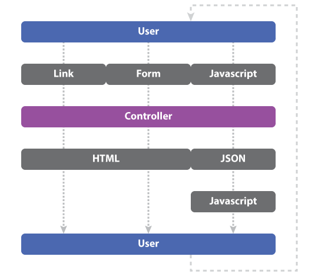

# React On Rails (w/ Auth)

## Learning objectives

- Give an example of when and why one might choose to put an React app on Rails.
- Utilize node scripts to build and move a React UI.
- Generate an API-only Rails application.
- Generate and retrieve auth tokens using Devise and LocalStorage.

## Framing

### Rails vs React

So far we've seen React apps with a custom built back-end using Express, and Rails apps with no front-end framework. Now we're going to combine the two and make a Rails app that uses React on the front-end.

Today we are going to be building an application takes advantage of the ease-of-use of Rails with the front-end power that we get from using React.

### Why?

In a typical Rails app the user interacts with data through some combination of links, forms, and JavaScript.



In a React-on-Rails app the user interacts with data just through JavaScript.


This means they have a "single point of contact" with your data. This has two advantages: the user experience may have more consistency (AJAX vs page refreshes), and you have fewer moving parts to worry about.

The trade off here is the need to write more JavaScript.

### Getting Started

We are going to build this today (but you will make it look a lot prettier): https://react-on-rails-solution.herokuapp.com/

The solution code is located in the directory next to this lesson if you get lost!

Lets start out by setting up our environment.

1. Create a Rails API application
```bash
  rails new tunr_react_rails --api -d postgresql
  cd tunr_react_rails
```
**IMPORTANT** Notice the `--api` flag.  This sets up a stripped down version of Ruby on Rails which removes views from the framework.  We will be handling the views in our React app.

This sets up our Ruby on Rails API and generates our file structure.  At this point we should be able to run a `rails s` and see the Rails Hello World screen, but there are a few more steps to include React in the application.

2. Create a React app through `create-react-app`
```bash
  create-react-app client
``` 
3. Create a `package.json` file at the root level and add this JSON
```json
{
  "name": "YOUR PROJECT NAME",
  "engines": {
    "node": "8.7.0"
  },
  "scripts": {
    "build": "cd client && npm install && npm run build && cd ..",
    "deploy": "cp -a client/build/. public/",
    "postinstall": "npm run build && npm run deploy && echo 'Client built!'"
  }
}
```
> WARNING!!! Be sure to replace "YOUR PROJECT NAME" above with your real project name.

> This package.json will be used to build the create-react-app and serve the static build file in production.  This is similar to the postinstall script we used when dealing with express in the past.

> Some magic is happening here.  Since we tell Heroku to install the build in the public folder, Heroku will open the index.html page that is in public when we hit the index route for our app

4. Set up a proxy for our dev server within the `client` level `package.json
```json
{
  "name": "client",
  "version": "0.1.0",
  "private": true,
  "proxy": "http://localhost:3001",
  ...
}
```
> This sets up the ability to call our Rails API without directly referencing localhost:3001

5. Create a script that allows our API server and dev server to run at the same time. In the past we used `concurrently`, however Ruby has a similar tool called `foreman`.
```bash
  gem install foreman
``` 

6. After installing `foreman`, create a file titled `Procfile.dev` and paste the following code.
```
web: sh -c 'cd client && PORT=3000 npm start'
api: rails s -p 3001
```

7. You are now able to use `foreman` and the `Procfile.dev` to set up your development environment.  
```bash
  foreman start -f Procfile.dev
```

With that, we can now start building React-On-Rails!

**COMMIT**

## Back-End: Ruby on Rails

### Model Set-Up and Seed
Now that we have our project properly set up, lets work on creating and seeding our data and serving it as an API for our React UI to consume.

```bash
  rails g model Artist name photo_url nationality
  rails g model Song title album preview_url artist:references
```

Let's seed our database with our old Tunr data. Copy the code for our seeds from this gist. [Tunr Seed Data](https://gist.github.com/king0120/a465fe25558c63bcb6d2a8091da1cea4)

Now let's create, migrate, and seed our database.  Then we can test and make sure that ActiveRecord can fetch the data we need

```bash
    rails db:create db:migrate db:seed
```

Finally, we'll add a has_many relationship to Artist
```ruby
# app/model/artist.rb
class Artist < ApplicationRecord
  has_many :songs, dependent: :destroy
end
```

Lets hop into the Rails console using `rails c` and validate that our information exists.

**COMMIT**

### Create API Routes
Since we are going to be using both React Router and Rails, we need to create an easy way to differentiate between our routes.  To do this, we will take advantage of Rails Namespaces.

Namespaces allow us to group together routes without needing an additional controller.  The tradeoff here is that our controllers will also need to be named in a way that signals it is part of a namespace.

Let's use the resources command to generate nested routes for our two models
```ruby
# config/routes.rb
Rails.application.routes.draw do
  namespace :api do
    resources :artists do
      resources :songs
    end
  end
end
```

Let's see all of the routes we now have available by running `rails routes`

**COMMIT**

### Generate Controllers
We now need to create controllers that can serve JSON information from Postgres to our app using ActiveRecord. In order to do that, we need to make a minor change to the actions that we've been creating up to this point.

**Important** Pay attention to the slightly different naming convention for this controller

```bash
    rails g controller api::artists
```

```ruby
  class Api::ArtistsController < ApplicationController
    def index
      @artists = Artist.all
      render json: @artists
    end
  end
```

We have to use this `render json:` method throughout our RESTful routes.  This will convert our Ruby hashes into a JSON object

```ruby
class Api::ArtistsController < ApplicationController
  def index
    @artists = Artist.all
    render json: @artists
  end

  def create
    @artist = Artist.create!(artist_params)

    render json: @artist
  end

  def show
    @artist = Artist.find(params[:id])

    render json: @artist
  end

  def update
    @artist = Artist.find(params[:id])
    @artist.update!(artist_params)

    render json: @artist
  end

  def destroy
    @artist = Artist.find(params[:id]).delete

    render status: :ok
  end

  private

  def artist_params
    params.require(:artist).permit(:name, :photo_url, :nationality)
  end
end
```

Notice the lack of a `new` and `edit` action.  We don't need these actions, because we will not need individual views for a user to create or update their model. 

We should now have a working API.  Let's use Postman to test our actions.

```
localhost:3001/api/artists
```

If we go back into Postman, we can now validate that our JSON API is working as intended.

**COMMIT**

### YOU DO (20 mins)
Now that we've created an Artist controller, create a Songs controller with all 5 RESTful routes.  Remember to check out `rails routes` to determent your route params.

**COMMIT**
**DEPLOY**

## Deploying to Heroku for the first time.
Now that we have a working API, let's get up and running on Heroku.
1. Run `heroku create YOUR_APP_NAME` to generate a new Heroku app.

> WARNING!!! Be sure to replace "YOUR_APP_NAME" above with the project name from your `package.json`.

2. Define custom buildpacks for Heroku. This will tell your application that we need both Ruby and Node in order to get our application to work.
```
heroku buildpacks:add --index 1 heroku/ruby
heroku buildpacks:add --index 2 heroku/nodejs
```
3. Create a file at your root level called `Procfile` and add the following line of code.  This will tell Heroku the command necessary to run your application.
```
web: rails s
```
4. Push your Heroku app using `git push heroku master`
5. Migrate and seed your DB using `heroku run rails db:migrate db:seed`

> If you receive an error along the lines of DB not existing, run the following command and try your migrations again. <br/> `heroku addons:create heroku-postgresql:hobby-dev`

## Front End: React

Now we have a working API. Let's start building our React UI!

### You Do
Look at these 3 wireframes for the Tunr UI and determine what types of React components we will need for this app.


### React Router Set Up

We set up our React app during an earlier step, but we still have a couple steps to go in order to set up the to.

Let's go into our client directory and install a few libraries to use in out React project.

```bash
  npm i styled-components axios react-router-dom
```

Next we need to add React Router to our project and make a few client-side routes to control the flow of our app.

```jsx
// App.js
import React, {Component} from "react";
import {BrowserRouter as Router, Route, Link} from "react-router-dom";
import ArtistList from "./components/ArtistList";
import Artist from "./components/Artist";
import "./App.css";

class App extends Component {
    render() {
        return (
            <Router>
                <div className="App">

                    <div>
                        <h1>Tunr</h1>
                        <div>
                            <div><Link to="/">All Artists</Link></div>
                        </div>
                    </div>

                    <Route exact path="/" component={ArtistList}/>
                    <Route path="/artist/:id" component={Artist}/>

                </div>
            </Router>
        );
    }
}

export default App;
```

This requires us to create several components.  Let's make basic components for ArtistList, Artist.

After creating those components, we should be able to test the links and validate that they are both valid.

**COMMIT**

### React Artists List
Let's first focus on building a list of Artists that link to their own individual Artist pages.

```jsx
// client/components/ArtistList.js
import React, { Component } from 'react';
import { Link } from 'react-router-dom';
import axios from 'axios';

class ArtistList extends Component {
    constructor(){
        super();
        this.state = {
            error: '',
            artists: []
        }
    }

    componentWillMount(){
        this.fetchArtists();
    }

    fetchArtists = async () => {
        try {
            const res = await axios.get('/api/artists');
            await this.setState({artists: res.data});
            return res.data;
        }
        catch (err) {
            console.log(err)
            await this.setState({error: err.message})
            return err.message
        }

    }

    render() {
        if (this.state.error){
            return <div>{this.state.error}</div>
        }
        return (
            <div>
                <h1>All Artists</h1>
                {this.state.artists.map(artist => (
                    <div key={artist.id}>
                        <Link to={`/artist/${artist.id}`} >{artist.name}</Link>
                    </div>
                ))}
            </div>
        );
    }
}

export default ArtistList;
```

#### async/await
You probably noticed above that we didn't use a `.then` & `.catch` block in the above code.  Instead we used some keywords you many not be familiar with, `async` and `await`.  This is a new feature of ES7, can be used with `create-react-app`, and was introduced in Node 8.  Basically, this new syntax makes asynchronous code look a little cleaner.  It achieves the same purpose as traditional promises.

```jsx
  fetchArtists = () => {
    axios.get('/api/artists').then(res => {
      return this.setState({artists: res.data});
    }).catch(err => {
      console.log(err)
      this.setState({error: err.message})
    })
  }
```

vs

```jsx
  fetchArtists = async () => {
      try {
          const res = await axios.get('/api/artists');
          await this.setState({artists: res.data});
          return res.data;
      }
      catch (err) {
          console.log(err)
          await this.setState({error: err.message})
          return err.message
      }
    }
```

For more info about async/await check out these links: 
[Async/Await in 10 minutes](https://tutorialzine.com/2017/07/javascript-async-await-explained)
[Async/Await - FunFunFunction ](https://www.youtube.com/watch?v=568g8hxJJp4)

### Show Individual Artist
Let's also go ahead and create a view that allows us to see info about a specific Artist

```jsx
// client/components/Artist.js
import React, {Component} from 'react';
import axios from 'axios';

class Artist extends Component {
    constructor() {
        super();
        this.state = {
            artist: {},
            songs: [],
        };
    }

    componentWillMount() {
        const artistId = this.props.match.params.id;
        this.fetchArtistAndSongData(artistId)
    }

    fetchArtistAndSongData = async (artistId) => {
        try {
            const artistResponse = await axios.get(`/api/artists/${artistId}`)
            const songsResponse = await axios.get(`/api/artists/${artistId}/songs`)
            await this.setState({
                artist: artistResponse.data,
                songs: songsResponse.data
            });
        }
        catch (error) {
            console.log(error)
            await this.setState({error: error.message})
        }
    }

    render() {
        return (
            <div>
                
                <h1>{this.state.artist.name}</h1>
                {this.state.songs.map(song => (
                    <div key={song.id}>
                        <h4>{song.title}</h4>
                        <audio controls src={song.preview_url}></audio>
                    </div>
                ))}
            </div>
        );
    }
}

export default Artist;
```

With this component, we now have the ability to traverse between an all artists and individual artist view.  

**COMMIT**

### Styling With Styled Components

**YOU DO** Spend ~30 minutes adding some styling polish to the app to make it look more similar to the wire frames above. 

**COMMIT**
**DEPLOY**
